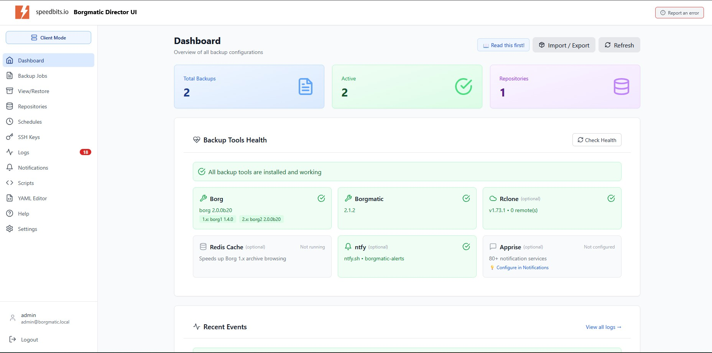
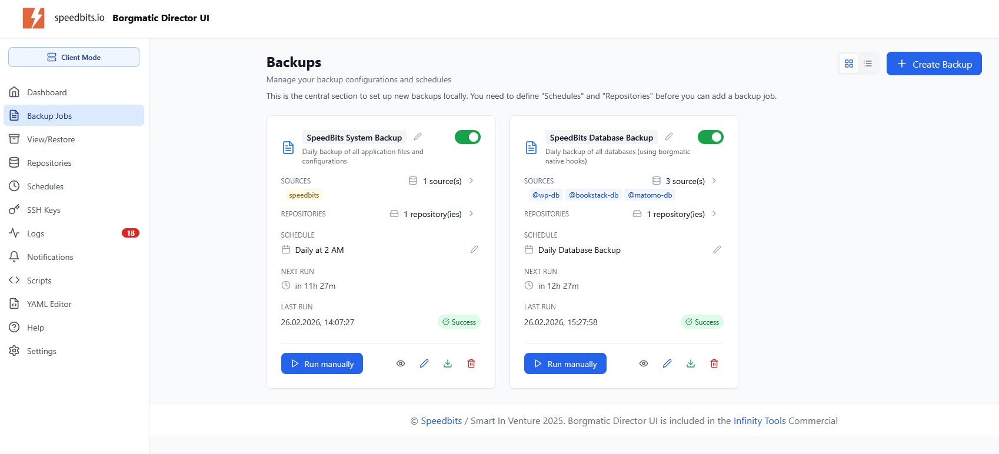
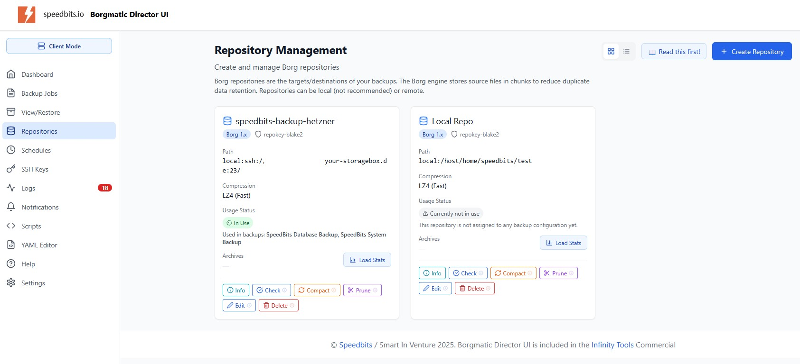
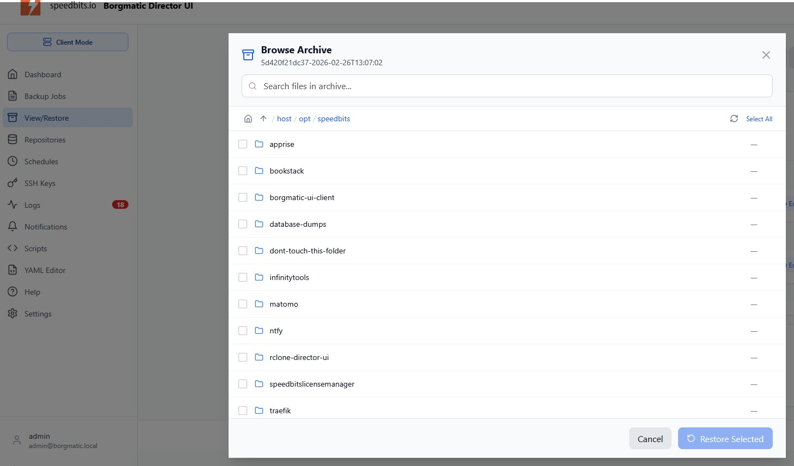
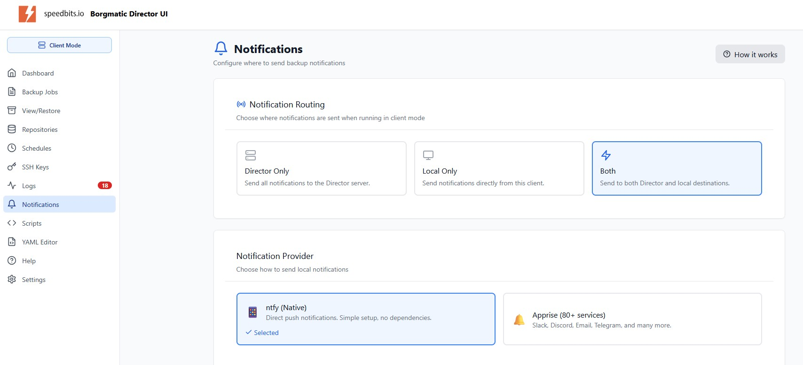

# Borgmatic Director UI

**A modern, powerful web interface for Borg Backup and Borgmatic**

Create, schedule, and manage backups on Linux servers with an intuitive UI. Supports files, databases, local and remote repositories - all fully Dockerized.



---

## Why Borgmatic Director UI?

Creating backups on Linux servers for files and databases isn't always straightforward. **Borg** and **Borgmatic** are robust, battle-tested backup solutions offering de-duplication, encryption, and backup-over-SSH. But they require command-line expertise and manual configuration.

**Borgmatic Director UI** brings these powerful tools to everyone with:

- A visual wizard for creating backups - no YAML editing required
- Automatic database discovery and backup configuration
- Point-and-click scheduling without learning cron syntax
- Visual archive browser for easy restores
- Real-time progress monitoring and notifications

---

## Features

### Backup Management
Create and manage backup jobs with a step-by-step wizard. Configure sources, destinations, schedules, and retention policies - all through an intuitive interface.



### Repository Support
Connect to virtually any storage backend:
- **Local** repositories on attached storage
- **SSH/SFTP** to remote servers
- **Hetzner Storage Boxes** (with native Borg 1.x support)
- **S3-compatible** storage (AWS, MinIO, Backblaze, etc.)
- **Rclone** for 70+ cloud providers

Built-in SSH key management makes setting up remote repositories simple.



### Database Backups
Automatic discovery and backup of your databases:
- **MariaDB / MySQL**
- **PostgreSQL**
- **MongoDB**
- **SQLite**

The wizard detects running database containers and configures backups automatically.

### Scheduling Made Easy
Visual schedule builder - no cron knowledge required:
- Predefined templates (daily, weekly, monthly)
- Custom schedules with visual time picker
- Execution history and status tracking

### Archive Browser & Restore
Browse your backup archives with a visual file explorer. Restore individual files or entire directories with a few clicks.



### Notifications
Get alerted when backups succeed or fail:
- **ntfy** - Native support for self-hosted notifications
- **Apprise** - Connect to 100+ notification services (Slack, Discord, Email, Telegram, and more)



### Additional Features
- **Borg 1.x and 2.x support** - Use the version that fits your needs
- **Live progress tracking** - Watch backups in real-time
- **Canary file protection** - Detect ransomware before it's too late
- **Retention policies** - Automatic cleanup of old backups
- **Health checks** - Monitor repository integrity

---

## Quick Start

### Option 1: Infinity Tools (Easiest)

The simplest way to get started:

1. Go to **[speedbits.io/infinity-tools](https://speedbits.io/infinity-tools/)**
2. Click **"Get Infinity Tools Now"** and download the free Community version (registration required)
3. Run the installer on your Linux server
4. In the menu, go to **"Infinity Apps"** → **"Borgmatic Director UI"** → Install

That's it! Infinity Tools handles Docker, SSL certificates, and configuration automatically.

### Option 2: Docker Compose

For those who prefer manual Docker setup:

```yaml
version: '3.8'
services:
  borgmatic-ui:
    image: ghcr.io/speedbitsinfinitytools/borgmatic-ui:latest
    container_name: borgmatic-ui
    ports:
      - "8000:8000"
    volumes:
      - ./config:/app/config
      - ./data:/app/data
      - /:/host:ro  # Access to host filesystem for backups
      - /var/run/docker.sock:/var/run/docker.sock:ro  # For database discovery
    environment:
      - NODE_ENV=production
    restart: unless-stopped
```

```bash
docker-compose up -d
```

Then visit `http://localhost:8000` to access the UI.

### Option 3: From Source (Development)

For contributors or those who want to run from source:

```bash
# Clone the repository
git clone https://github.com/smartinventure/borgmatic-ui-community.git
cd borgmatic-ui-community

# Install dependencies
cd frontend && npm install && cd ..
cd nodejs && npm install && cd ..

# Build frontend
cd frontend && npm run build && cd ..

# Start the server
cd nodejs && npm start
```

Visit `http://localhost:8000` to access the UI.

**Requirements:** Node.js 18+, npm, Borg and Borgmatic installed on the host.

### First Steps

Once running:
1. Create an SSH key (Settings → SSH Keys)
2. Add a repository (Repositories → Add New)
3. Create a backup job (Backup Jobs → Create New)
4. Set up notifications (Settings → Notifications)

---

## Editions

### Community Edition (This Repository)

**Free for personal and private use.**

Includes all core features:
- Standalone and Client modes
- Full backup management
- All repository types
- Database discovery and backup
- Notifications
- Archive browsing and restore

### Commercial Edition

For commercial use or to unlock **Director Mode**, visit **[www.speedbits.io](https://www.speedbits.io)**.

**Director Mode** provides centralized management for multiple servers:

| Feature | Community | Commercial |
|---------|:---------:|:----------:|
| Standalone Mode | ✅ | ✅ |
| Client Mode | ✅ | ✅ |
| **Director Mode** | ❌ | ✅ |
| Centralized notifications | ❌ | ✅ |
| Multi-client management | ❌ | ✅ |
| Client impersonation | ❌ | ✅ |

**Director Mode advantages:**
- **Centralized notifications** - All backup alerts from all clients flow through one Director
- **Multi-client management** - Connect dozens of backup clients to a single Director
- **Client impersonation** - View and manage any client's UI directly from the Director

---

## Licensing

This software is provided under a **dual license**:

- **Community License** - Free for personal, private, non-commercial use
- **Commercial License** - Required for business/commercial use

**Personal and private use is free forever.**

For commercial licensing, please visit **[www.speedbits.io](https://www.speedbits.io)**.

---

## Requirements

- Docker and Docker Compose
- Linux host (for backup sources)
- 512MB RAM minimum, 1GB recommended

---

## Support

- **Issues**: Use GitHub Issues for bug reports
- **Commercial Support**: [support@speedbits.io](mailto:support@speedbits.io)
- **Website**: [https://speedbits.io](https://speedbits.io)

---

## Infinity Tools

Using **Infinity Tools**? Borgmatic Director UI is included! Install it directly from the Infinity Tools menu under Apps.

[Get Infinity Tools](https://license.speedbits.io/register/infinitycommunity)

---

**© 2025 Smart In Venture GmbH, Germany. All Rights Reserved.**

*Built with care by the Speedbits team.*
